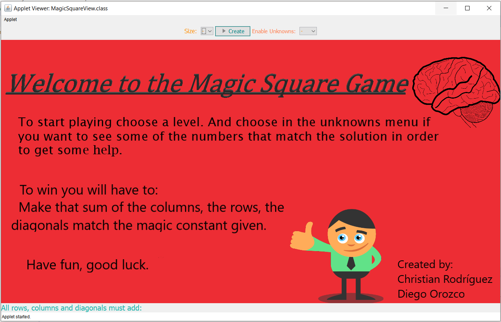
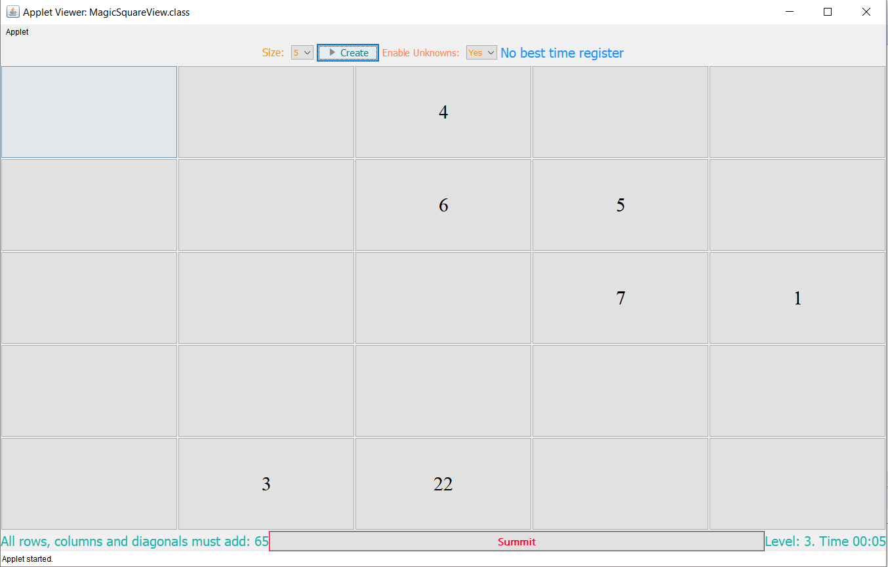

## The Magic Square

It is a game in java, based on the  [magic square](https://en.wikipedia.org/wiki/Magic_square) problem.

#### What is the Magic Square?

 It is a table where the whole numbers are placed in their boxes.
 Meets the following conditions:
- The sum of the numbers of any line (horizontal, vertical or diagonal) will be always the same one
- The numbers of a magic square must be all the different ones.
- Any magic square can be constructed by numbers that form an [arithmetic progression](https://en.wikipedia.org/wiki/Arithmetic_progression).

Magical squares are distributions of numbers in cells that are arranged forming a square, so that the sum of any of the rows, of which of the columns and the two main diagonals always gives the same result. The resulting number is called the **magic constant**.

For example, in the following magic picture they have arranged the numbers of the 1 to 9. There can be verified that his magic constant is 15, that is to say, the sum of the rows, columns and diagonals is 15.

### What does this program do?

  This is a game based on the magic square problem, the user will be able to choose
  different levels, challenging the player mind. The levels goes from a simple
  3 x 3 where the magic constant is 15 to a 7 x 7 matrix where difficult goes up.

  Here is a screen capture of the main menu:

  So after the user choose a level, he will be able to get some help using the unknowns menu, if he selects yes the program will display the matrix with some
  spaces all ready fill as shown

  

  In order to change a value he just need to click where he want to change the value, and a window to insert a value will be shown. After you complete the entire square, you press the summit bottom.
  
  The games makes all the necessary validation in order to know if the user already won the game or if he loses. Also if there is a best record of time for that level it will show it. The panel also shows the time since the user pressed the create button, and you can see there is a label where you can see how much does the columns, the rows, the diagonals must sum.
