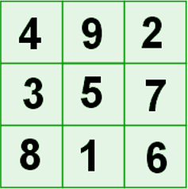

## The Magic Square

It is a game in java, based on the  [magic square](https://en.wikipedia.org/wiki/Arithmetic_progression) problem.

#### What is the Magic Square?

 It is a table where the whole numbers are placed in their boxes.
 Meets the following conditions:
- The sum of the numbers of any line (horizontal, vertical or diagonal) will be always the same one
- The numbers of a magic square must be all the different ones.
- Any magic square can be constructed by numbers that form an [arithmetic progression](https://en.wikipedia.org/wiki/Arithmetic_progression).

Magical squares are distributions of numbers in cells that are arranged forming a square, so that the sum of any of the rows, of which of the columns and the two main diagonals always gives the same result. The resulting number is called the **magic constant**.

For example, in the following magic picture they have arranged the numbers of the 1 to 9. There can be verified that his magic constant is 15, that is to say, the sum of the rows, columns and diagonals is 15.

### Description
**Horizontal:**
1.	- 4 + 9 + 2 = 15
2.	- 3 + 6 + 7 = 15
3.	- 8 + 1 + 6 = 15

**Vertical:**
1.	- 7 + 3 + 8 = 15
2.	- 9 + 5 + 1 = 15
3.	- 2 + 7 + 6 = 15

**Diagonal:**
1.	- 4 + 5 + 6 = 15
2.	- 2 + 5 + 8 = 15

### Types of Magic Square

- If the magic square has three rows and three columns, that is, nine squares. Therefore it will have nine numbers, it is called a magic squares of order three.
- If the magic squares has four rows and four columns, that is, sixteen squares and sixteen numbers, it is called a magic squares of order four.
- **In general**, if the magic squares has "n" rows and "" columns, that is, n ^ 2 squares and n ^ 2 numbers, it is called magic squares of order "n".
that there are no magic squares of order 2.

#### The game is going to have several levels that the user will be able to choose:
###### Easy mode
1. Complete magical square of order n

2. A Square of order even
3. A Square of odd order

###### Hard mode
** Special Magic Square **
1. Only multiples of order 6. It is composed exclusively of multiples of 6. Its magic constant is 666.
2. Chess:
  - Of order 8 formed by the numbers from 1 to 64.
  - Sum of rows, columns and diagonals = 260
  - Sum of the 4 corners and the 4 central numbers = 1040
  - Add white squares = add black squares = 1040
3. Double Magic Square:
- Of order 5 formed by the numbers from 1 to 25, that contains another Magic Square of order 3 inside.
- The magic constant of the major square is equal to 75. The square of minor size is 45.

